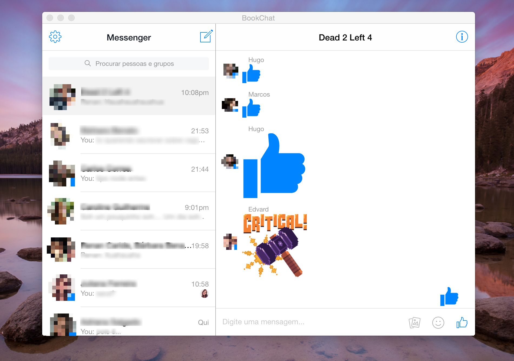

# BookChat

Unofficial facebook chat, built using webview and [Electron](https://github.com/atom/electron).

## Installation and Usage

You can download BookChat from [release](https://github.com/matheusfaustino/bookchat/releases) page. It's cross-platform(Linux, MacOS, Windows).
Click in app icon and be happy.

## Why use it?

If you are like me and don't like to use webapps(like that) in your browser, you should try this app.

## Push notification

To enable push notification you must click in gear icon (top left) > settings > allow push

## TODO list

- [ ] Make this app installable using npm
- [ ] Put a loading image

## Disclaimer

This is NOT a official facebook app.

## License

[MIT](https://tldrlegal.com/license/mit-license)

